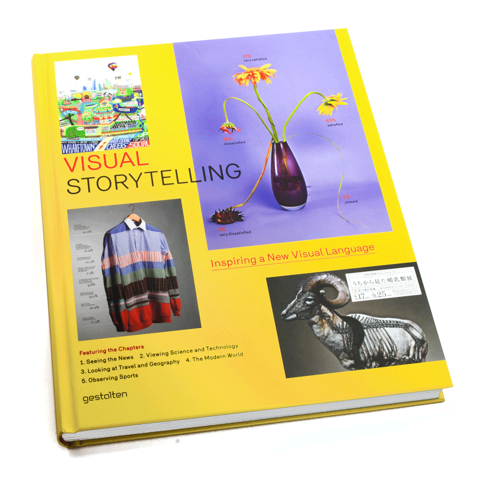

# Product biography

- [Designbrief](#designbrief)
  - [The Things Network](#the-things-network)
  - [Target audience](#target-audience)
  - [CLEVER°FRANKE (WIP)](#clever%C2%B0franke)
  - [Design challenge](#design-challenge)
  - [Focus (WIP)](#focus)
  - [Vision](#vision)
  - [Planning](#planning)
- [Research](#research)
	- [Target audience](#target-audience)
		- [Interviews](#interviews)
		- [Survey](#survey)
	- [Data](#data)
		- [Analysis](#analysis)
		- [Workshop](#workshop)
	- Benchmark creation
		- Online
		- Books
- Inzichten
	- Data priority
	- User requirements
	- Moodboard
- Product
	- Concept schetsen
	- Top 3 concepts
	- High-fi 3 concepts
	- Design 0.1
	- Design 0.2
	- Design 0.3
	- Data pre-processing
	- Tech stack
	- Prototype
- [Sources](#sources)

## Designbrief

This graduation project is about using **The Things Network's** data to help their target audience understand that they are building a global, crowdsourced, open, free and decentralized _Internet of Things_ network.

This idea came to be in a conversation between the CEO of The Things Network (TTN) and the co-founder of CLEVER°FRANKE (C°F) in which they discussed a potential collaboration, but due to TTN's non-profit nature it couldn't be a commercial one. It was therefor decided that when C°F acquired a talented graduate, who also happens to be interested in the network, a pro-bono project mainly led by the graduate would take place.

### The Things Network

  

Before we dive into the details of this project, it is important to understand what problem The Things Network originally tried to solve, what _Internet of Things_ means, and how the network works.

#### History

The year is 1988, commercial computers are starting to become reasonably sized with dimensions similar to a small oven with around 8MB of RAM. A huge leap for home computing, yet only affordable for the aristocracy as prices could be as high as $6,500 (Thompson and Baran, 1988). This was also the year in which Mark Weiser, chief scientist at Xerox PARC (Palo Alto Research Center Incorporated), first introduced the term _'ubiquitous computing'_ ("Mark Weiser", N.D, para. 1). Ubiquitous computing, or _'ubicomp'_ for short, is a concept in which computing is made to appear everywhere and anytime. Weiser was obviously ahead of his time as most people couldn't comprehend what ubicomp would entail in daily life beyond their desk.

Today that's different. The transient clumsy desktop computer has been diversified into everyday objects, some the size of a breadcrumb and barely visible to naked eye if one isn't paying attention, or as Weiser (1991) puts it: _"specialized elements of hardware and software, connected by wires, radio waves and infrared, will be so ubiquitous that no one will notice their presence"_. Take Amsterdam for instance, the roads already have barely visible sensors present to improve traffic flow, some houses already have a smart thermostat that let's the user warm up the house before they arrive, and even self driving cars could be considered part of ubiquitous computing.

But if computers are intertwined into the real world, making everyday objects 'smart', then it's smartness only reaches as far as it's usefulness in isolation. We can observe motion and turn on a lightbulb, but what if we want all the lights to gradually change colour during the day? What if we want to move away from the set of disjointed experiences and offer a coherent service such as Claire Rowland (2009) describes: _"It’s important to consider not just the usability of individual UIs but interusability: distributed user experience across multiple devices"_.

Case in point: The buzz surrounding the Internet of Things. What's the buzz? Daniel Burrus (N.D) explains it: _"The Internet of Things revolves around increased machine-to-machine communication; it’s built on cloud computing and networks of data-gathering sensors; it’s mobile, virtual, and instantaneous connection"_. It is what will power the interusability. It can be as simple as a very small computer with a WiFi chip and manually connect it to the internet so it can communicate, or perhaps you can integrate a SIM card to use your telecom provider's network. Either way, it will be up to you or a remuneration to make it work.

Which brings us to The Things Network (N.D), a non-profit and open-source driven organisation focused on pushing interusability forward, or as they put it themselves:

> "The Things Network is building a network for the Internet of Things by creating abundant data connectivity, so applications and businesses can flourish. The technology we use is called LoRaWAN and it allows for things to talk to the internet without 3G or WiFi. So no WiFi codes and no mobile subscriptions. It features low battery usage, long range and low bandwidth. Perfect for the internet of things."

#### How it works

The main building block of the network is the gateway. Small, easy to install, it essentially is a router between the things and the internet. With it you are creating the most substantial aspect of your connected city’s network.

The Things Network's original kickstarter compaign (N.D) describes the following advatages of the gateway:

> - About 20% of the cost of any currently available LoRaWAN gateway
> - Provides up to 10 km / 6 miles radius of network coverage
> - Connects easily to your WiFi or Ethernet connection
> - Security through the https connection and embedded in the LoRaWAN protocol
> - Runs on open hardware 
> - Contains GPS to determine the gateway’s location and node's location later
> - Can serve up to 10,000 nodes

##### LoRaWAN - A new technology optimized for connectivity of things
> All this is enabled by a technology called LoRa. LoRa is a low energy, low bandwidth, long range (over 10km / 6 miles) wireless technology and uses an open data frequency. As we are setting up the network together there is no need for an operator. This amazing technology allows for things to talk to the internet without 3G, WiFi or Bluetooth. No wifi codes, heavy battery usage or worse, monthly subscriptions needed. 

> The technology was standardized by the [LoRa Alliance](https://lora-alliance.org/) and is a result of a collaboration between IBM and chipmaker Semtech. LoRaWAN is currently active on different open frequencies. The Things Network is an official member of the LoRa Alliance.

> The technology is currently enrolled in France, the Netherlands, Switzerland, Belgium and South Africa. All by larger telecommunication corporations. To make this an open network with no subscriptions we propose a decentralized, crowdsourced alternative to telcos. And to get there we need affordable and open, hardware. 

#### Problem

At the time of writing there are 4524 gateways up and running worldwide, each extending the network by a few kilometres. Immense amount of data pours through it every second and currently one can only look at the technical insights of the gateway's their allowed to see. There are, however, social insights on their website such as communities to organise meet-ups and provide updates near you, as well as labs where users can share stories about their creations. Besides those, there are still a lot of interesting, but inaccessible, data for the user in the The Things Network's backend. It is clear that there could and should be a encapsulating product that brings those things together, a product that truly shows the impact and possibilities of the network.

The initial briefing at The Things Network illustrated that this product is necessary to clear their lacking transparency and therefor lesser authority.

##### The current challenges

- Clarifying what the technology is and how the network works .
- Showing for what kind of applications you can use it (what it does and doesn’t).
- Explain that it’s open en created and used by the community.
- Reaching their target audience.
- Finding professional partners who can build solid solutions with TTN.

If you were to take a look at their website, you'll only see a map with the locations of the connected gateways as can be seen above. Owners of a gateway can log-in to gain insights into their gateway's traffic, but that's only for those who are authorised to see it. There isn't something that shows what is really going on inside the network for newcomers or people interested in metrics beyond their sole gateway.

##### Expectations

The challenges from the meeting also resulted in certain expectations.

- Create transparency in data.
- Show size and impact of network.
- Gain Authority.
- Should be based on real data from TTN.
- Show performance of TTN.
- Prevent people from using TTN for unrealistic applications.
- Show applications of successful solutions.
- Easy to understand during conference presentation.
- Using storytelling techniques to tell the story behind TTN.

### Target audience
**The target audience are early adopter and early majority Internet of Things developers who are interested yet unfamiliar with LoRaWAN.**

Early majority and adopters are terms part of the diffusion of innovations theory that seeks to explain how, why, and at what rate new ideas and technology spread (Wikipedia, 2018).

  
  
Diffusion of innovation

  
<i>https://cryptosigma.files.wordpress.com/2014/09/graph.jpg</i>

Everett Rogers, a professor of communication studies, summarized the categories (Wikipedia, 2018) as:

- **Innovators** – Innovators are willing to take risks, have the highest social status, have financial liquidity, are social and have closest contact to scientific sources and interaction with other innovators. Their risk tolerance allows them to adopt technologies that may ultimately fail. Financial resources help absorb these failures.
- **Early adopters** – These individuals have the highest degree of opinion leadership among the adopter categories. Early adopters have a higher social status, financial liquidity, advanced education and are more socially forward than late adopters. They are more discreet in adoption choices than innovators. They use judicious choice of adoption to help them maintain a central communication position.
- **Early majority** – They adopt an innovation after a varying degree of time that is significantly longer than the innovators and early adopters. Early Majority have above average social status, contact with early adopters and seldom hold positions of opinion leadership in a system.
- **Late majority** – They adopt an innovation after the average participant. These individuals approach an innovation with a high degree of skepticism and after the majority of society has adopted the innovation. Late Majority are typically skeptical about an innovation, have below average social status, little financial liquidity, in contact with others in late majority and early majority and little opinion leadership. 
- **Laggards** – They are the last to adopt an innovation. Unlike some of the previous categories, individuals in this category show little to no opinion leadership. These individuals typically have an aversion to change-agents. Laggards typically tend to be focused on "traditions", lowest social status, lowest financial liquidity, oldest among adopters, and in contact with only family and close friends. 

#### So how does this translate back to our IoT developers?
Right now The Things Network is making the jump from early adopters to early majority and that causes a shift in how you want to approach them. Early adopters tend to need some assurances of credbility and reliability, where's that should be a given for the early majority and they rather see what you can do with it.

Because TTN is transitioning between these two, the product should therefor focus on a mixture of both.

### CLEVER°FRANKE

This project is done with help of C°F.

### Design challenge
**How can an interactive and storytelling data driven experience convince
early adopter and early majority Internet of Things developers who are interested yet unfamiliar with LoRaWAN, of the credibility, impact, and underlying technology of the network so they are eager to participate?**

#### Sub-challenges

1. What is interactivity?
2. What is storytelling?
3. How do you validate the target audience's needs and priorities?
4. How do you assure users of the creditability and impact of the network? 
5. How do you integrate the clarification of LoRaWAN into the product?
6. How do you make a user eager to participate?

### Focus
In order or importance:
#### 1. Concept
The concept is the groundwork of the entire project

#### 2. Technical realisation

#### 3. UX/Visual design

### Vision
As the data will be the main starting point besides the requirements and the problems of the target audience, we can already predict possible interesting correlations regardless of the concept. For example the aggregated data, the technical summaries of the gateways, is very contrasting in nature to social data such as communities which is about meet-ups and updates from closely gathered people. Yet adding a more everyday social side to the performance metrics is what potentially could make it more compelling, as it could involve the user on a more personal and/or local level. In the end it will come down to a carefully chosen ratio between technical and social, one more apparent than the other, based on what the target audience values the most as the outcome should increase the conversion in participation, but the form remains unknown for now.

### Planning

#### 13 April
The fist meeting with The Things Network is mainly introductory  to get the know the organisation and what it stands for.

*Deliverables*

	- What are TTN's foremost challenges for the near future.
	- Who are the users.
	- What does TTN hope to gain out of this project.
	- The extend, availability, and maintainability of the data.

*How*

	- Interview
	- Sketchnotes

#### 23 - 27 April (1 week)
Knocking out remaining uncertainties surrounding the data and the target audience while doing desk research on Internet of Things, The Things Network, and LoRaWAN.

*Deliverables*

	- Target audience specification with their main problem, when it occurs, and why.

*How*

	- Follow-up interview
	- Survey
	- Sketchnotes
	- Deskresearch

#### 30 April - 4 May (1 week)
Reces.

#### 7 - 30 May (3 weeks)
The prerequisites are there, now it is time to come up with an idea.

*Deliverables*

	- Acquire definitive goals and requirements
	- Inspiration research on similar products.
	- Concept brainstorm
	- Proof of concept
	- Finalise concept 

*How*

	- Competitive analyses
	- Benchmark creation
	- Brainstorm
	- Peer review

#### 1 June
Pitch the concept to The Things Network.

#### 2 - 31 June (4 weeks)
These weeks are all about defining the UX and how a storytelling experience could be achieved.

*Deliverables*

	- Low-fidelity prototype
	- Style guide (typography, colours, layout)
	- High-fidelity prototype
	- Tech stack

*How*

	- Prototyping
	- Storytelling
	- Co-creation

#### 2 - 6 July (1 week)
Because this is the final week before the summer break this time will be spend on splitting everything up into small tasks and create an entire backlog for development. This is also the week where to concept will be tested in the form of a prototype with the target audience.

*Deliverables*

	- Backlog
	- User testing results
	- Possible concept, UX, or visual adjustments

*How*
	
	- Defining features
	- Splitting up features
	- Interviews

#### 7 July - 12 August
Summer break.

#### 13 August - 7 September (4 weeks)
In these weeks to product will come to life in the form of a MVP, which will also be user tested.

*Deliverables*

	- Minimal viable product
	- User testing rapport

*How*

	- Development
	- User testing

#### 10 - 28 September (3 weeks)
Iteration will be the sole purpose of these weeks.

*Deliverables*

	- Product 0.9

*How*

	- Development

#### 1 - 19 October (3 weeks)
Iteration will be the sole purpose of these weeks.

*Deliverables*

	- Product 1.0

*How*

	- Development
	- Visual adjustments
	- UX adjustments

#### 22 - 26 October (1 week)
Promo video and finalise documentation.

#### 29 October - 2 November (1 week)
Presentation and finalise documentation.

## Research
### Target audience
#### Interviews
We want to find out what drives people to learn about TTN and what topics and metrics of the available data are especially relevant so they can be prioritised.

##### Goals
- What drives them to find out about LoRaWAN and The Things Network?
- How important is the credibility of the network? (how mature and stable)?
- How relevant is it to understand the underlying technology?
- How much do they care about real-time performance metrics of the network?
- How much do they care about communities and what goes on near them?
- What is the most important thing they'd need to know before they consider participating?

##### Introduction
Before jumping straight to the questions surrounding TNN and the underlying technology, a few introductory questions are asked to make each other feel comfortable and to get a better understanding of whom I am talking to.

1. Could you tell me a bit about yourself?
2. When did you first get into IoT and why?
3. Are you currently into IoT professionally or more has a hobby?
4. At what scale do of IoT do you operate on?
5. Could you chronologically tell me about a few of your creations or IoT projects you participated in?

##### The Things Network
1. How do you usually approach internet connectivity?
	1. Is that process troublesome? If so, why?
2. Have you heard of a technology called LoRaWAN?
	1. Could you elaborate how it works?
3. Have you heard of The Things Network?
	1. Could you elaborate how it works?

*Explain or elaborate LoRaWAN and The Things Network*

The Things Network (TTN) is building a network for the Internet of Things by creating abundant data connectivity, so applications and businesses can flourish. It is a distributed network by the users, for the users, and there are currently already 3838 gateways up and running worldwide. TTN is an open-source and non-profit organisation and one can participate in multiple ways to help the network and yourself.

The technology they use is called LoRaWAN and it allows for things to talk to the internet without 3G or WiFi. So no WiFi codes and no mobile subscriptions.

It features low battery usage, long range and low bandwidth. Perfect for the internet of things.

More information: https://www.thethingsnetwork.org/

1. Do you have any questions that immediately come to mind?
2. Is this something that interests and might help you?
3. What would you consider to be the most important factors before considering your participation in the network?
3. In what way would you be interested to participate? (Infra, hardware, software)
4. Is it important to you to comprehend how the network runs on LoRaWAN?
5. How important is the maturity and stableness of the network to you? Is there some sort of minimal requirement? Would you be interested in (real-time) performance metrics?
6. Are active communities within the network near you something that would interest you? Why? Would you consider working together with someone through the network?
7. Now that we talked about multiple aspects of the network such as the communities, the hardware, software, performance, maturity, and the underlying technology - what things matter to most to you? (ranking)

##### Results
Some answers are only documented in part to leave out irrelevant context.

###### Daan Rongen
**Could you tell me a bit about yourself?**

> Student of the Intelligent Environments minor.

**When did you first get into IoT and why?**

**Are you currently into IoT professionally or more has a hobby?**

**At what scale do of IoT do you operate on?**

**Could you chronologically tell me about a few of your creations or IoT projects you participated in?**

##### Conclusion

#### Survey
The Things network send out a survey with multiple questions through their newsletter. A summary of the results can be found below.

##### What are you mainly using The Things Network for?

| Reason                                                                  | Count   | Percentage |
| :---------------------------------------------------------------------- | :------ | :--------- |
| To learn about / experiment with LoRa and LoRaWAN                       | 124     | 29%        |
| To develop commercial LoRa / LoRaWAN products or services               | 88      | 21%        |
| Personal reasons / hobby                                                | 68      | 16%        |
| To join the mission of building an open and decentralized network       | 60      | 14%        |
| Research & education                                                    | 44      | 10%        |
| To build a PoC                                                          | 20      | 5%         |
| To build professional relationships in the LoRaWAN industry             | 10      | 2%         |
| To interact with the community (on the Forum, Slack or community pages) | 5       | 1%         |
| Other                                                                   | 22      | 5%         |
| **Total**                                                               | **426** | **100%**   |

##### What subjects are you mainly interested in?
*This questions was multiple choice which means every reason is relative to the total amount of participants.*

| Reason                                                        | Percentage |
| :------------------------------------------------------------ | :--------- |
| Open Source development                                       | 58%        |
| LoRaWAN education                                             | 52%        |
| Community building                                            | 44%        |
| Interoperability with other LoRaWAN networks                  | 40%        |
| Conferences and events                                        | 26%        |
| Offering products/services via The Things Network Marketplace | 23%        |
| Access to professional LoRaWAN partners                       | 21%        |
| Buying/reselling private LoRaWAN networks                     | 20%        |

##### What is your occupation?

| Occupation                 | Count   | Percentage |
| :------------------------- | :------ | :--------- |
| Software developer         | 111     | 26%        |
| Hardware developer         | 62      | 15%        |
| Network engineer/architect | 54      | 13%        |
| Academic or researcher     | 47      | 11%        |
| Student                    | 36      | 9%         |
| Product manager            | 33      | 8%         |
| Sales or account manager   | 5       | 1%         |
| Marketeer                  | 3       | 1%         |
| Other                      | 79      | 19%        |
| **Total**                  | **422** | **100%**   |

##### How would you describe the main activity of your company?

| Activity                     | Percentage |
| :--------------------------- | :--------- |
| Product Development          | 30%        |
| Education or research        | 19%        |
| IT consultancy               | 15%        |
| Systems Integrator           | 12%        |
| Application service provider | 8%         |
| Network Operator             | 5%         |
| (Electronic) distributor     | 1%         |
| Other                        | 10%        |

##### Conclusion
So what does this tell us about the target audience? It seems the most profound use of The Things Network is to experiment with LoRaWAN and secondly to pursue a commercial goal. But if you take the other non-commercial motivations like hobby's and research into account it's fair to say that most people are in it for themselves. The interest in LoRaWAN is further proven as it comes in as the second subject their most interested in, together with Community building. Further more, the companies these people work for seem to be the most into product development and also a surprisingly large education or research part. Overall does the target audience mainly consist of Software Developers who are also into Open Source development.

### Data

#### Analysis
A Broker handles a range of device addresses and is responsible for finding the right Handler to forward each message to.

The Handler is responsible for encryption, decryption and conversion of messages and for forwarding messages to applications

##### Aggregations (30 sec & 1 hour summaries)
###### Broker / Handler

* Apps with the most uplinks
* Apps with the most downlinks
* Devs with the most uplinks
* Devs with the most downlinks
* Uplinks overtime
* Downlinks overtime
* Hour or day with the most uplinks
* Hour or day with the most downlinks
* Hour or day with the most uplink bytes
* Hour or day with the most downlink bytes

*Amount of…*
* Uplinks
* Downlinks
* Apps
* Devs
* Gateways
* ID’s (a.k.a regions e.g. ’ttn-broker-eu’)

*Percentage of…*
* ID’s (a.k.a regions e.g. ’ttn-broker-eu’)
 
---

###### Gateway

* Percentage bandwidth x with spreading factor x
* Uplinks vs. bandwidth
* Downlinks vs. bandwidth
* Uplinks vs. spreading factor
* Downlinks vs. spreading factor
* Gateways responsible for half of uplink network traffic
* Hour or day with the most uplinks
* Hour or day with the most downlinks
* Hour or day with the most uplink bytes
* Hour or day with the most downlink bytes

*If total gateways is known:*
* Active gateways (online at least once during period)
* Online ratio of active gateways during period
* Gateways with online ratio >= 0.99 during period
* % of gateways with online ratio >= 0.99 during period

*Amount of…*
* Uplinks
* Downlinks
* Uplink bytes
* Downlink bytes

*Percentage of…*
* Bandwidth (125 vs 250 vs 500)
* Spreading factor (1 vs … vs. 12)
* Frequency range

---

###### Communities

* Date of creation vs. communities (e.g. 5 communities exist for 2 years)
* Number of gateways per community
* Official communities vs. Communities

*Total…*
* Communities
* Official communities
* Contributors
* Core contributions
* Meet-ups
* Posts
* Stories

*Updates:*
 * Community published
 * New post
 * New meet-ups
 * New gateway
 * Story is public on Labs
 * New group on Labs
 * New partner
 * New community
 * Reach N contributors
 * Community becomes official
 * New member community
 * Update community page
 * Nearby community is published
 * Nearby community official
 * Nearby community meetup
 * New community resource
 * New core member
 * New story from community contributor
 * Month Anniversary Community
 * Year Anniversary Community

###### NOC
* Location of gateways (long, lat)
* Altitude of gateways (1 …. 300?)

###### Cross-set combinations
* Uplinks vs. gateway locations
* Downlinks vs. gateway locations
* Meetups vs. Locations
* Gateways responsible for half of uplink network traffic vs. Locations

#### Workshop

▶ *Photo of the meeting room where the data workshop took place*

The data workshop was setup to prioritise the findings from the data analysis. The presentation can be found [here](./docs/data-workshop.pdf).

*explain the steps of the workshop...*

---

##### Result
- Multiple scales: global, country, city
- Make certain metrics more appealing by contextualising it in the most relevant scale.
- Potential gamification through uptime and uplink / downlink efficiency
- Slightly move from proving trust to this is what you can do.

###### Data priority

These are the metrics with the highest priority.

*Brokers & handlers*
- Total Apps
- Total Devs
- % ID's
- Uplinks / downlinks broken down by time (e.g by day)
- Hour or day with the most uplinks / downlinks

*Gateways*
- Total uplinks / downlinks
- Uplinks / downlinks vs. Spreading factor
- Uplinks / downlinks vs. Location
- Frequency range usage
- Gateways responsible for half of the uplink/downlink traffic
- Active gateways (online at least once during period)
- Online ratio of active gateways during period
- Gateways with online ratio >= 0.99 during period
- % of gateways with online ratio >= 0.99 during period

*Communities*
- Total communities
- Total meetups

*Updates*
- New meet-up
- New community
- Community becomes official
- Anniversaries

### Benchmark creation
| Infographic Designer's Sketchbooks                          | Visual Storytelling                                       | Information Graphics                                       |
| :---------------------------------------------------------- | :-------------------------------------------------------- | :--------------------------------------------------------- |
|  |  |  |

## Sources

Burrus, D. N.D. The Internet of Things Is Far Bigger Than Anyone Realizes. Retrieved April 19, 2018 from https://www.wired.com/insights/2014/11/the-internet-of-things-bigger/

Giezeman, W. N.D. The Things Network. Retrieved September 23, 2018 from https://www.kickstarter.com/projects/419277966/the-things-network

N.A. (2017, December 20). Mark Weiser. Retrieved April 19, 2018 from https://en.wikipedia.org/wiki/Mark_Weiser

N.A. The Things Network. Building a fully distributed Internet of Things infrastructure. Retrieved April 19, 2018 from https://www.thethingsnetwork.org/

N.A. (2018, September 19). Diffusion of innovations. Retrieved September 23, 2018 from https://en.wikipedia.org/wiki/Diffusion_of_innovations

Roland, C. (2009). Designing Connected Products. Retrieved April 19, 2018 from http://www.designingconnectedproducts.com/

Thompson, T. & Baran, N. (1988, November). "The NeXT Computer". Retrieved May 10, 2018, from http://simson.net/ref/NeXT/byte_article.html

Weiser, M. (1991, September). The Computer for the 21st Century [PDF]. Retrieved April 19, 2018 from 
https://www.lri.fr/~mbl/ENS/FONDIHM/2012/papers/Weiser-SciAm91.pdf
