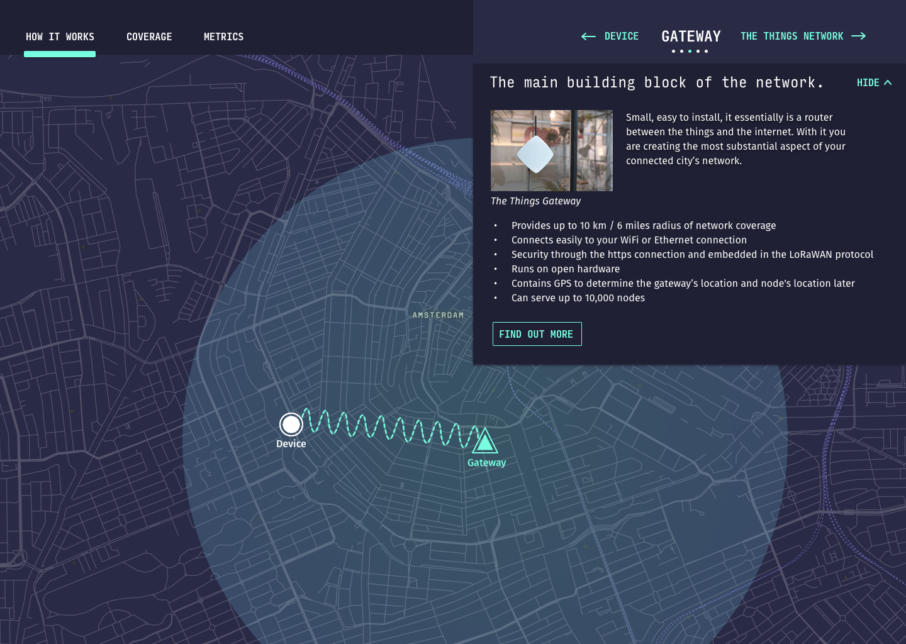
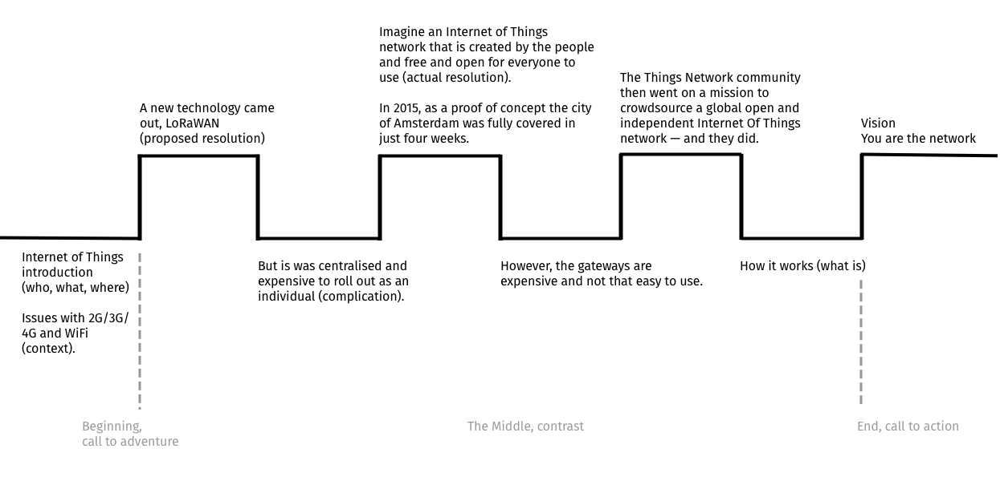
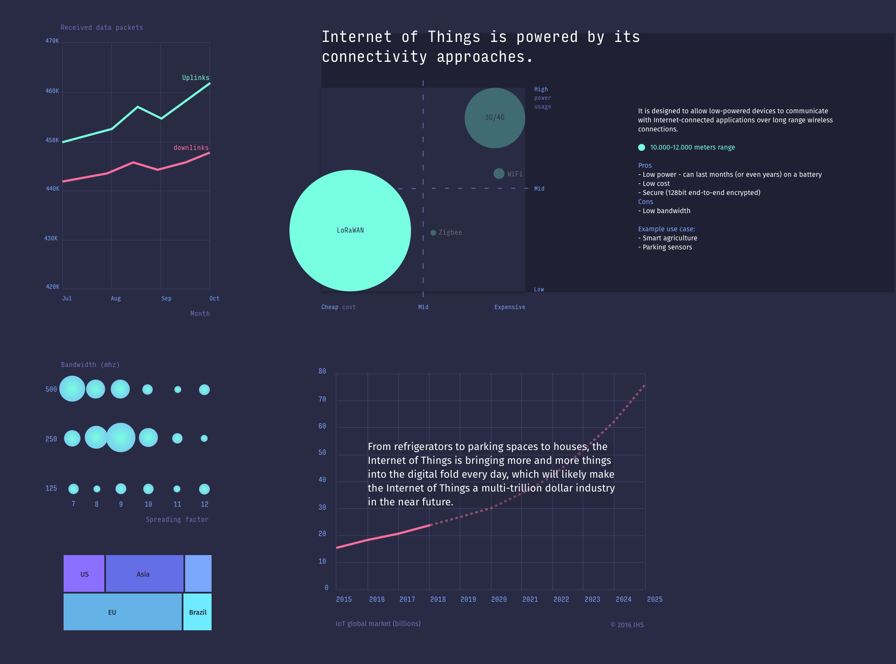
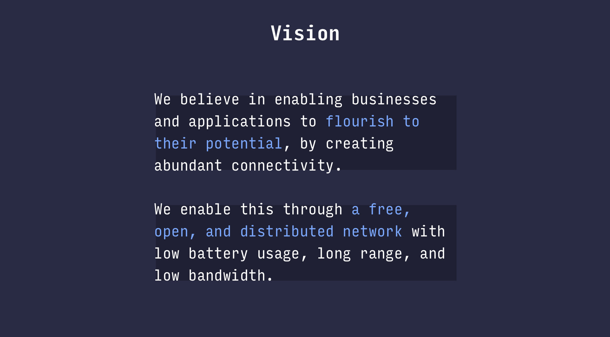
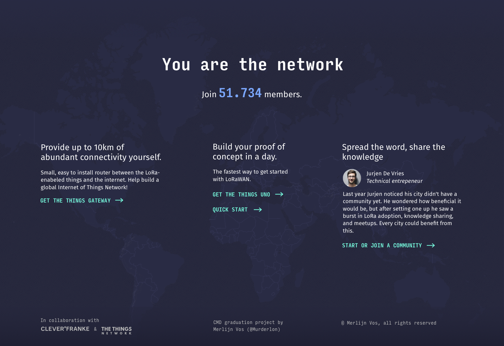

# Design rationale

> **Project:** The Things Network    **Stakeholders:** CLEVER°FRANKE , The Things Network   **By:** Merlijn Vos   **Student ID:** 500706469   **Date:** 28 October 2018   **Coach:** Marije Ten Brink 

This graduation project is about using **The Things Network's** story and data to help their target audience understand that they are building a global, crowdsourced, open, free and decentralized _Internet of Things_ network.

*More background information on Internet of Things itself as well as The Things Network can be found in the [product biography](./product-biography).*

## What are we trying to solve?

At the time of writing there are 4524 gateways up and running worldwide, each extending the network by a few kilometres. Immense amount of data pours through it every second and currently one can only look at the technical insights of the gateway's their allowed to see. There are, however, social insights on their website such as communities to organise meet-ups and provide updates near you, as well as labs where users can share stories about their creations. Besides those, there are still a lot of interesting, but inaccessible, data for the user in the The Things Network's backend. It is clear that there could and should be a encapsulating product that brings those things together, a product that truly shows the impact and possibilities of the network.

The initial briefing at The Things Network illustrated that this product is necessary to clear their lacking transparency and therefor lesser authority.

##### The current challenges

- Clarifying what the technology is and how the network works .
- Showing for what kind of applications you can use it (what it does and doesn’t).
- Explain that it’s open en created and used by the community.
- Reaching their target audience.
- Finding professional partners who can build solid solutions with TTN.

##### Expectations

- Create transparency in data.
- Show size and impact of network.
- Gain Authority.
- Should be based on real data from TTN.
- Show performance of TTN.
- Prevent people from using TTN for unrealistic applications.
- Show applications of successful solutions.
- Easy to understand during conference presentation.
- Using storytelling techniques to tell the story behind TTN.

## Target audience

**The target audience are early adopter and early majority Internet of Things developers who are interested yet unfamiliar with LoRaWAN.**

Early majority and adopters are terms part of the diffusion of innovations theory that seeks to explain how, why, and at what rate new ideas and technology spread (Wikipedia, 2018).

  
  
Diffusion of innovation

  
<i>https://cryptosigma.files.wordpress.com/2014/09/graph.jpg</i>

The Diffusion of Innovation Theory (Wayne W, 2018), summarized the categories as:

- **Innovators** – These are people who want to be the first to try the innovation. They are venturesome and interested in new ideas. These people are very willing to take risks, and are often the first to develop new ideas. Very little, if anything, needs to be done to appeal to this population..
- **Early adopters** – These are people who represent opinion leaders. They enjoy leadership roles, and embrace change opportunities. They are already aware of the need to change and so are very comfortable adopting new ideas. Strategies to appeal to this population include how-to manuals and information sheets on implementation. They do not need information to convince them to change.
- **Early majority** – These people are rarely leaders, but they do adopt new ideas before the average person. That said, they typically need to see evidence that the innovation works before they are willing to adopt it. Strategies to appeal to this population include success stories and evidence of the innovation's effectiveness.
- **Late majority** – These people are skeptical of change, and will only adopt an innovation after it has been tried by the majority. Strategies to appeal to this population include information on how many other people have tried the innovation and have adopted it successfully.
- **Laggards** – These people are bound by tradition and very conservative. They are very skeptical of change and are the hardest group to bring on board. Strategies to appeal to this population include statistics, fear appeals, and pressure from people in the other adopter groups.

### So how does this translate back to our IoT developers?

Right now The Things Network is making the jump from early adopters to early majority and that causes a shift in how you want to approach them. Early adopters tend to need some assurances of credibility and reliability, where's that should be a given for the early majority and they rather see what you can do with it.

Because TTN is transitioning between these two, the product should therefor focus on a mixture of both.

## CLEVER°FRANKE

[CLEVER°FRANKE](http://cleverfranke.com/) is a data driven design agency located in Utrecht. Their focus lies mostly within visualising complex data structures on the web to provide insights which normally wouldn't be possible.

Their vision as they put it themselves:

> We want to provide people with the means to interact with and experience the world in new and exciting ways. Through these enriched experiences, we aim to reveal new perspectives, ultimately leading to a better understanding of the world we live in.

C°F's co-founder Gert Franke will provide occasional guidance and feedback during this project. C°F's incentive to help comes from a educational stance, and thus will this project be treated similarly to an internship.

## Design challenge

How can an interactive and **storytelling** **data driven** experience **convince** early adopter and early majority Internet of Things developers who are interested yet unfamiliar with LoRaWAN, of the **credibility**, **impact**, and **underlying technology** of the network so they are **eager to participate**?

## Process

### Laying the groundwork for a concept
Before diving into a concept brainstorm some barriers and requirements needed to be defined.

#### The target audience's goals.
To get a better understanding of the target audience, interviews took place and a survey was sent out. The key discoveries are discussed below and more details can be found in the [product biography](./product-biography).

What are you mainly using The Things Network for?

| Reason                                                                  | Count   | Percentage |
| :---------------------------------------------------------------------- | :------ | :--------- |
| To learn about / experiment with LoRa and LoRaWAN                       | 124     | 29%        |
| To develop commercial LoRa / LoRaWAN products or services               | 88      | 21%        |
| Personal reasons / hobby                                                | 68      | 16%        |
| To join the mission of building an open and decentralized network       | 60      | 14%        |
| Research & education                                                    | 44      | 10%        |
| To build a PoC                                                          | 20      | 5%         |
| To build professional relationships in the LoRaWAN industry             | 10      | 2%         |
| To interact with the community (on the Forum, Slack or community pages) | 5       | 1%         |
| Other                                                                   | 22      | 5%         |
| **Total**                                                               | **426** | **100%**   |

One of the more interesting discoveries is that it seems the most profound use of The Things Network is to experiment with LoRaWAN and secondly to pursue a commercial goal. But if you take the other non-commercial motivations like hobby's and research into account it's fair to say that most people are in it for themselves. The interest in LoRaWAN is further proven as it comes in as the second subject their most interested in, together with community building (see product biography).

#### The most important data

After a thorough analysis of the data a workshop was setup to prioritise the findings from the data analysis. The presentation and steps can be found [here](./assets/data-workshop.pdf).

This resulted in a list of data points with the highest priority as well as a better understanding of data ownership and the feasibility of a 'real-time' API.

### Concept discovery 
A rigorous brainstorm sketching session resulted in a diverse set of possibly valid ideas. These can be bound in the [product biography](./product-biography).

Three ideas were chosen to present to The Things Network.

#### Performance dashboard
The first concept is a safe choice, an interactive analytics dachboard. It represents the current state of The Things Network and is mostly focused on performance metrics.

#### Packet Traveller
The Packet Traveller is a storytelling and animated experience in which the user follows a single packet through all the network's underlying steps. It's also very convenient that the underlying steps happen to be almost the same as the available data sets (e.g Broker step has a broker data set).

#### Compare
Date & location compare dashoard. It's focused on performance metrics as well, but in a different form.

---

In conjuction with The Things Network the '**Packet Traveller**' was deemed the best approach because of its storytelling possibilities and clever mix of explaining the network while presenting their data. 

### Proposed resolution, the 'Packet Traveller'

> Full design can be found [here](./attachments/design-0.2.pdf).

The design above was the result of multiple iterations based on expert reviews by a team of professionals from CLEVER°FRANKE. These reviews can be found in the [product biography](./product-biography).

The 'Packet Traveller' as presented consists of three sections or rather pages.

- **How it works**   An interactive map that takes you through the underlying steps of the network by following the signal, a signal that starts at the device, and changes as it goes through each step. These steps are backed up with an explanation and facts.
- **Coverage**   Coverage of all the active gateways, the locations of TTN's servers, and pop-up stories from user creations.
- **Metrics**   data visualisations from TTN's data.

---
However, in the midst of running a project at scale for the first time, with multiple stakeholders with different opinions, sole responsibility for all the disciplines and no experience to validate it and take away the uncertainty — I lost track of the bigger picture.

The thought process that led to the above product/design was unnecessarily focused on the perfect functional representation of the underlying steps of the network and the data to back it up. Yet, when we take a step back, what is the story it actually tells?

I realised I needed to take that step back, research again, and follow similar steps to that of a traditional writer — nailing down your story, defining visual grammar, developing a story arc, and finding threads to weave through the entire narrative — that's what makes us able to design content that makes a lasting impact on the audience.

The question is, how do we design stories to be great user experiences?

### Persuasive storytelling, a new approach
The new research backed approach, to answer the concluding question above, can be found in the [product biography](./product-biography). 

## Actual resolution, a scroll based storytelling single-page app
This new product has been tailored to the audience through multiple iterations based on user testing. See it all in the [product biography](./product-biography).

[Click here to see a video of the end result](https://vimeo.com/297553711).

### Storytelling
Based on the 'Contour of Communication', the following description is taken from the product biography.

> Presentations should have a clear beginning, middle, and end. Two clear turning points in a presentation’s structure guide the audience through the content and distinctively separate the beginning from the middle and the middle from the end. The first is the call to adventure—this should show the audience a gap between what is and what could be—jolting the audience from complacency. When effectively constructed—an imbalance is created—the audience will want your presentation to resolve this imbalance. The second turning point is the call to action, which identifies what the audience needs to do, or how they need to change. This second transition point signifies that you’re coming to the presentation’s conclusion.

> Notice how the middle moves up and down as if something new is happening continually. This back and forth structural motion pushes and pulls the audience to feel as if events are constantly unfolding. An audience will stay engaged as you unwrap ideas and perspectives frequently.

> The 'Contour of Communication' from Nancy Duarte's book 'Resonate'. 

> The Things Network's contour of the story.

### Data driven
Based on the data workshop with The Things Network (see product biography), their prefered data has been visualised to support the story.

### Credibility, impact, and underlying technology.
At the end of the user tests some questions were asked, partially open and partially multiple choice. The latter were statements to which users needed to  choose a number from a scale, based on how much they agreed with it. In which 1 is strong disagree, and 5 strong agree. The following two questions are related to the credibility, impact, and underlying technology.

- **Do you have a basic understanding of LoRaWAN?**
> Two out of three users chose 5 (strong agree) and one chose 4.
- **Does TTN feel like a stable and credible platform?**
> Two out of Three users chose 4, one chose 5.

### Convincing to participate

▶︎ The Golden Circle ([image.slidesharecdn.com](http://image.slidesharecdn.com/gc100212-13497124030829-phpapp01-121008111025-phpapp01/95/start-with-why-how-to-present-the-golden-circle-5-638.jpg?cb=1415966918))

The research into persuasive storytelling showed that *people don't buy what you do, people buy why you do it*. We therefor don't want a closing note with emphasis on how it's the biggest and cheapest IoT network out there. We rather want to tell why The Things Network does what they do.

Simon Sinek, in his TED talk "How great leaders inspire action" explains it:

> In other words, when we communicate from the outside in, yes, people can understand vast amounts of complicated information like features and benefits and facts and figures. It just doesn't drive behavior. When we can communicate from the inside out, we're talking directly to the part of the brain that controls behavior, and then we allow people to rationalize it with the tangible things we say and do.

In the story, we present The Things Network's vision from the inside out.

This is than followed up with the call to actions. 

Accoring to Duarte (2012), whether a presentation is political, corporate, or academic, the audience consists of four distinct types of people capable of taking action: doers, suppliers, influencers, and innovators

- **Doers** — ask doers to assemble, make decisions, gather, respond, or attempt.
- **Suppliers** — ask suppliers to acquire, fund, support, or provide resources.
- **Influencers** — ask influencers to activate, convert, empower, or promote.
- **Innovators** — ask innovators to create, discover, invent, or pioneer.

These types of people correlate nicely with the participating options of TTN.

- Connect your own device
- Extend the network, setup your own gateway
- Create or join a community, organise or join meetups.

They correspond in the following way.

| Who | What  |
|:--|:--|
| Doers | Connect your own device |
| Suppliers | Extend the network | 
| Influencers, innovators | Communities / meetups |

This is how they are incorporated into the story:

Dr. Robert Cialdini's Principles of Persuasion are proven factors of influence. The list consists of:

1. **Reciprocity**  
People are obliged to give something back in exchange for receiving something.
2. **Scarcity**  
People want more of those things they can have less of.
3. **Authority**  
People follow the lead of credible, knowledgeable experts.
4. **Consistency**  
People like to be consistent with the things they have previously said or done.
5. **Liking**  
People prefer to say yes to those that they like.
6. **Consensus** (Social Proof)  
Especially when they are uncertain, people will look to the actions and behaviors of others to determine their own.

In the context of our call to actions it's not possible to implement every one of theses principles, but the following are implemented.

- **Authority**  
"Join 54.743 member"
- **Liking**  
Areas of similarity that you share with the users result in higher conversion, TTN's vision is there to resonate with the users on this.
- **Consensus** (Social Proof)  
Industry leaders who already participated in certain ways help persuade users. *"Last year Jurjen, a technical entrepreneur, noticed his city didn't have a community yet. He wondered how beneficial it would be, but after setting one up he saw a burst in LoRa adoption, knowledge sharing, and meetups. Every city could benefit from this. Start or join a community"*.

## Conclusion
Lots of concept directions were explored during this project and it wasn't always smooth sailing, but on-the-fly learning and adapting from first time mistakes has eventually kept this project afloat. 

To come back to question that started it all:

> How can an interactive and **storytelling** **data driven** experience **convince** early adopter and early majority Internet of Things developers who are interested yet unfamiliar with LoRaWAN, of the **credibility**, **impact**, and **underlying technology** of the network so they are **eager to participate**?

The end result tells the true story of The Things Network and how they came to be. Contrast creates contour and by continually switching back and forth between problem and solution, or what is and what could be, we let the audience feel as if events are constantly unfolding. 

Further more, we created a bit more transparency in The Things Network's data, which normally only lives in their backend, by supporting certain parts of the story with relevant and insightful data.

The star moment is the contrasting reveal of a world covered by community powered gateways compared to their previous single-city proof of concept. We let the users know that this abundant connectivity phenomenon is in fact very real.

Truly inspired users are in it for themselves, because they believe in what the organisation believes. In the end that's the very thing that's being conveyed by the story, the fact that The Things Networks mission, why they do it — starts with them. You are the network. 

### Recommendations

#### Time & location controls for the data visualisations
The obtained data allows for location based insights opposed to only global, which might be more personal to a user if it's their country's data. Time could also be controlled by the user. Although both require significantly more complex data pre-processing, it could be worth it in the end.  

#### Let the user control the story
Right now the story is linear, you can't change the story to your liking. An improvement could be explore multiple routes while maintaining the same messages we want to convey.

#### Make the actual resolution visually feel like one
The visual style is rather dark themed and doesn't change along the way. The introduction of The Things Network could change the entire style to a more lighter feeling. This could help in making it feel like a real resolution and a clear difference between what is and what could be.

## Sources
Duarte, N. (2010). Resonate, present visual stories that transform audiences. New Jersey, Hoboken: John Wiley & Sons Inc.

N.A. (2018, September 19). Diffusion of innovations. Retrieved September 23, 2018 from https://en.wikipedia.org/wiki/Diffusion_of_innovations

Sinek, S. (2009, September). How great leaders inspire action [Video]. Retrieved October 2, 2018 from https://www.ted.com/talks/simon_sinek_how_great_leaders_inspire_action

Wayne, W. (2018, August 29). Diffusion of Innovation Theory. Retrieved September 24, 2018, from http://sphweb.bumc.bu.edu/otlt/MPH-Modules/SB/BehavioralChangeTheories/BehavioralChangeTheories4.html